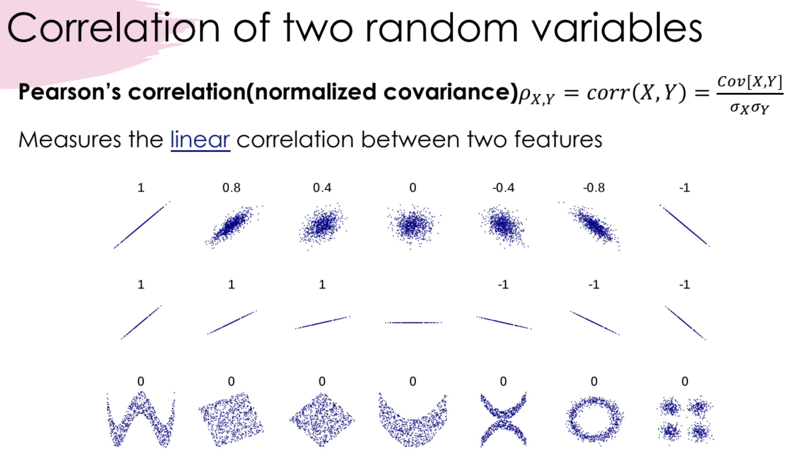

# 25Fall Group Discussion Session I

\[
    \newcommand{\E}[1]{\mathbb{E}\!\left[#1\right]}
\]

In this session, we cover some questions or topics in Linear Algebra, Multivariable Calculus, Prob \& Stats, as well as K-methods. We also discuss some miscellaneous questions raised by students.  

[TOC]

## An Overview
Why Linear Algebra, Multivariable Calculus, and Prob \& Stats? 
- **Linear Algebra:** models \& data are large scale. Knowing how to compute scalars is not enough.
- **Prob \& Stats:** machine learning models the world as probability distribution. 
- **Multivariable Calculus:** differentiability is the backbone of most machine learning optimization algorithms.

Example:
N students come to our group discussion session. Will they ace the quiz on Friday?
- N students and their quiz scores: represented as a vector or a matrix.
- coming to group discussion = getting a good score?
$\to P(\text{good score}|\text{group discussion})=0.999$
- logistic regression (don't worry, you'll learn later)
$L(\theta)=-\sum_{i=1}^{N} \log P_{\theta}(\text{score}_i|\text{attendance}_i)$, gradient=$\nabla_{\theta} L(\theta)$
Differentiable, we can easily optimize it and quantize the correlation between the two.

## Linear Algebra 

### Rank

### Determinant

### Symmetry & PSD

## Multivariate Prob \& Stats

We move from scalar $x$ to vector $X\in\R^d(\R^{d\times 1})$. Keep in mind:
- $x^2 \to \begin{cases}X^TX \in \R^1 \\ XX^T \in \R^{d\times d}\end{cases}$
- $\frac{1}{x} \to X^{-1}$
- $\exp(x) \to \exp(X) \in \R^d$
- $f(x)=ax^2+bx+c \to f(x)=x^TAx+b^Tx+c$

### Expectation \& Variance
- $\mathbb{E}(x) \to \mathbb{E}[X]\in\R^d$
- $\text{Var}(x)=\mathbb{E}(x^2)-\mathbb{E}(x)^2$
$$
\begin{align*}
    \Sigma=\text{Cov}[X]&=\mathbb{E}[(X-\mathbb{E}[X])(X-\mathbb{E}[X])^T]\\
    &=\mathbb{E}[XX^T-\mathbb{E}[X]X^T-X\mathbb{E}[X]^T+\mathbb{E}[X]\mathbb{E}[X^T]]\\
    &=\mathbb{E}[XX^T]- \mathbb{E}[X]\mathbb{E}[X]^T
\end{align*}
$$

### Gaussian Distribution
PDF:
- $f(x)=\exp(-(x-\mu)^2/2\sigma^2)/\sqrt{2\pi}\sigma \to$
$f(x)=\exp(-(x-\mu)^T\Sigma^{-1}(x-\mu)/2)/(2\pi)^{\frac{d}{2}}|\Sigma|^{\frac{1}{2}}$

Proof:
- Goal: $\int_{x}f(x)dx=1$
- Let $x=\mu+\Sigma^{-\frac{1}{2}}y$, then $dx=d|\Sigma^{-\frac{1}{2}}|y=d|\Sigma|^{-\frac{1}{2}}y$
- When $x, y$ is $1$-D, $|\Sigma|^{-\frac{1}{2}}=\frac{1}{\sigma}$, $\int_{y} \exp(-\frac{1}{2}y^2) dy=\sqrt{2\pi}$, therefore $\int_{x}\exp()$
- When $x, y$ is $d$-D, $\int_{y}\exp(-\frac{1}{2}y^Ty)dy=\int_{y}\exp(-\frac{1}{2}y_1^2-\dots-\frac{1}{2}y_d^2)dy=\Pi_{i=1}^{d}\int_{y_i}\exp(-\frac{1}{2}y_i^2)dy_{i}=(2\pi)^{\frac{d}{2}}$
- Therefore, 
$$
\begin{align*}
    &\int_{x}\exp(-(x-\mu)^T\Sigma^{-1}(x-\mu)/2)dx\\
    =&|\Sigma|^{\frac{1}{2}}\int_{x}\exp(-(x-\mu)^T\Sigma^{-1}(x-\mu)/2)d|\Sigma|^{-\frac{1}{2}}x\\
    =&|\Sigma|^{\frac{1}{2}}\int_{x}\exp(-y^Ty/2)dy\\
    =&(2\pi)^{\frac{d}{2}}|\Sigma|^{\frac{1}{2}}
\end{align*}
$$

## Bayes Rule

## `numpy`

### Sample Quiz
1. **Which statement about the Gaussian Distribution is incorrect?**
A. The Gaussian distribution is fully determined by its mean and variance.
B. The Gaussian distribution is symmetric about its mean.
C. The Gaussian distribution has compact (finite) support (support$:=\{x|f(x)>0\}$).
D. The Gaussian distribution is closed under linear transformations.
2. **Which of the following matrices has an eigen-decomposition (spectral decomposition) and is the most general (i.e., it generalizes all other options that have eigen-decomposition)?**
A. Any real square matrix.
B. Any symmetric real matrix.
C. Any diagonalizable real matrix.
D. Any orthogonal matrix.
3. **Suppose that $X$,$Y$ are random variables, and $\alpha$ is a scalar, which of the following equations are incorrect**?
A. $\mathrm{Var}(\alpha X) = \alpha^2 \mathrm{Var}(X)$.
B. $\mathrm{Var}(X+Y) = \mathrm{Var}(X) + \mathrm{Var}(Y)$
C. $\mathbb{E}[\alpha X] = \alpha \mathbb{E}[X]$.
D. $\mathrm{Cov}(X,Y) = \mathbb{E}[XY] - \mathbb{E}[X]\mathbb{E}[Y]$.
4. **For any PSD matrices $A$ and $B$ of the same shape, which of the following is not always PSD (select all that apply)?** 
A. $A+B$.
B. $ABA$.
C. $AB$.
D. $A-B$.
5. **The K-Means algorithm is guaranteed to converge to the global minimum.**
A. True.
B. False.
6. **If two variables have a zero covariance/coefficient, we can conclude that the two variables are independent.**
A. True.
B. False.

## Misc
1. How can I catch up with the math part?
2. How to learn everything in advance by myself?
3. Is there any way to learn more about this field?
4. Perhaps abt how bayes rules are implemented in ml like it feels like doing the reverse of prediction?

## Related Materials
1. [NYU Intro to Robot Learning HW1](https://nyu-robot-learning.github.io/robot-intel-class-sp23/assets/files/hw1_theory-69e639924c3c002cadfb5676bb7a3fbe.pdf)
2. [The Matrix Cookbook](https://www.math.uwaterloo.ca/~hwolkowi/matrixcookbook.pdf)